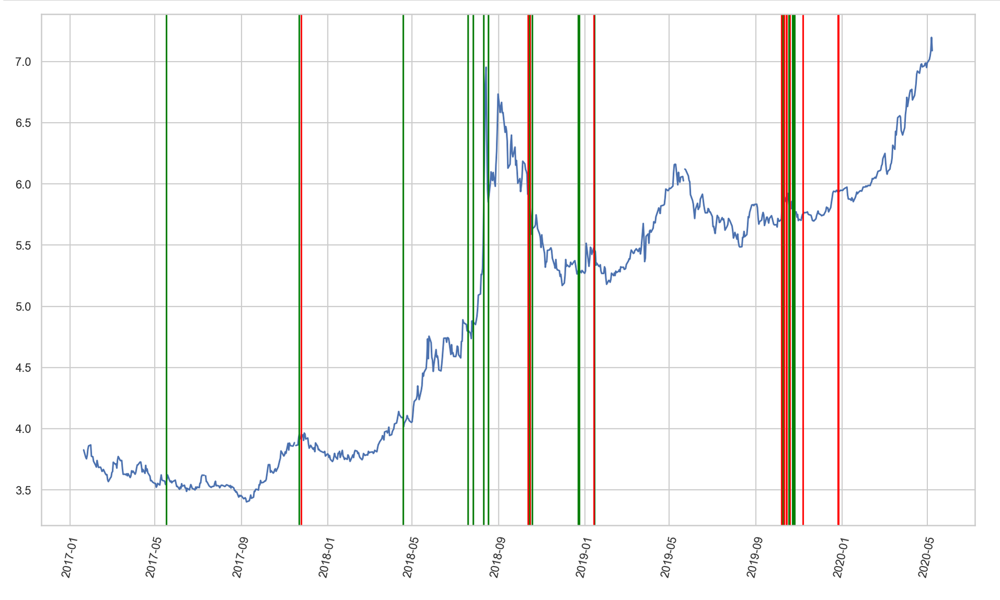

# Sentiment Analysis on Trump Tweets

This is just a fun project for learning Jupyter Notebook and other python stuff. Therefore this work does not put any opinion. But it will share a graph.

vaderSentiment is used for sentiment analyisis in this notebook.

Green lines shows positive tweet,
red lines shows negative tweet and blue line shows USD/TL

